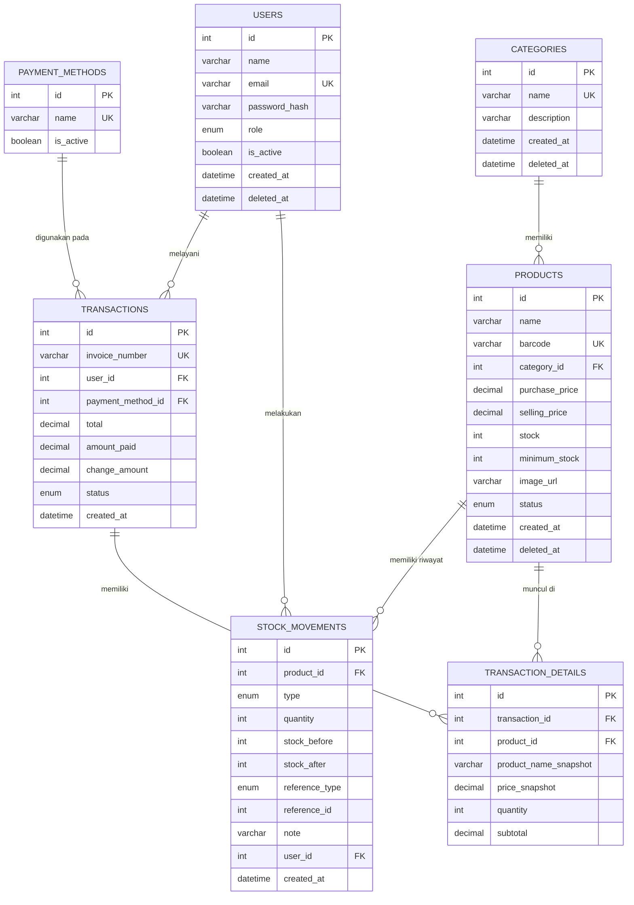

# PRODUCT REQUIREMENTS DOCUMENT
# KASIR PINTAR — Point of Sale, Product & Inventory Management System

**Versi Dokumen:** 1.0
**Status:** Draft untuk Review
**Tipe Dokumen:** PRD + Application Skills Logic + Business/System Logic

---

## 1. PRODUCT OVERVIEW

Kasir Pintar adalah aplikasi Point of Sale (POS) berbasis web yang terintegrasi dengan manajemen produk, kategori, dan inventori (stok). Aplikasi dirancang responsif untuk digunakan di Desktop/Laptop (kasir meja, back-office), Tablet (kasir mobile di toko), dan Mobile/HP (kasir keliling, scan barcode via kamera).

Aplikasi berfungsi sebagai satu sumber kebenaran (single source of truth) untuk:
- Data produk dan kategori
- Level stok real-time
- Transaksi penjualan dan riwayatnya
- Pergerakan stok (stock movement) sebagai audit trail

**Stack Teknologi (fixed, tidak diganti tanpa alasan teknis kuat):**
Next.js, TypeScript, React, Tailwind CSS, shadcn/ui, Next.js Route Handlers + Server Actions, MySQL, Prisma ORM, Zod, React Hook Form, Auth.js (atau kompatibel), Lucide Icons, Browser Camera API / Barcode Detection API (dengan fallback library scanner).

---

## 2. PROBLEM STATEMENT

Toko/ritel skala kecil-menengah sering mengalami:
1. Transaksi lambat karena pencarian produk manual.
2. Kesalahan pencatatan stok karena dicatat manual/terpisah dari transaksi.
3. Tidak ada visibilitas produk yang stoknya menipis/habis sampai kejadian (kehabisan saat pelanggan sudah di kasir).
4. Tidak ada riwayat transaksi yang terstruktur untuk audit atau evaluasi.
5. Proses tambah produk baru saat menemukan barcode belum terdaftar memakan waktu (harus pindah aplikasi/sistem).

Kasir Pintar menyelesaikan ini dengan POS yang terhubung langsung ke inventori secara atomic (transaksi dan pengurangan stok terjadi dalam satu unit kerja yang konsisten).

---

## 3. GOALS

G1. Mempercepat proses transaksi kasir (search & scan barcode cepat).
G2. Memberi visibilitas stok real-time (Aman/Menipis/Habis) per produk.
G3. Menjamin integritas data stok dan transaksi (tidak ada kondisi setengah-berhasil).
G4. Mendukung multi-device (Desktop, Tablet, Mobile) dengan UX yang sesuai konteks masing-masing.
G5. Menyediakan fondasi data (transactions, transaction_details, stock_movements) yang siap dipakai untuk laporan penjualan di masa depan.
G6. Menerapkan role-based access control minimal (Admin, Kasir).

## 4. NON-GOALS (Out of Scope untuk versi ini)

NG1. Laporan penjualan analitik mendalam (grafik trend, forecasting) — hanya disiapkan fondasi datanya, bukan fiturnya.
NG2. Multi-cabang/multi-outlet (multi-tenant per lokasi) — **OPEN DECISION**, lihat bagian 24.
NG3. Integrasi pembayaran digital real (payment gateway QRIS resmi) — di MVP, QRIS dicatat sebagai metode pembayaran, bukan diverifikasi otomatis via gateway.
NG4. Manajemen supplier/purchase order penuh.
NG5. Diskon/promo kompleks (voucher, tiered discount) — dibahas sebagai OPEN DECISION.
NG6. Printer thermal native integration — MVP menyediakan struk sebagai halaman cetak/PDF, bukan driver printer khusus.

---

## 5. TARGET USERS

- **Pemilik toko / Admin**: mengelola katalog produk, kategori, stok, memantau ringkasan penjualan harian, mengatur metode pembayaran, mengelola akun kasir.
- **Kasir**: melayani transaksi pelanggan secara cepat dan akurat menggunakan search/scan barcode.

---

## 6. USER ROLES

### 6.1 Admin
Akses penuh: dashboard, produk, kategori, stok (semua state), transaksi (semua kasir), metode pembayaran, manajemen pengguna/kasir, pengaturan.

### 6.2 Kasir
Akses terbatas: melakukan transaksi (POS), search & scan produk, kelola keranjang miliknya, checkout, melihat riwayat transaksi miliknya sendiri, melihat info stok yang relevan untuk transaksi (read-only, tidak bisa ubah data produk/kategori/stok kecuali diberi permission eksplisit).

**Prinsip RBAC:** Default deny. Setiap route/endpoint administratif eksplisit memerlukan role `ADMIN` atau permission tertentu. Kasir tidak pernah mendapat akses tulis ke `products`, `categories`, `payment_methods`, `users` kecuali izin granular ditambahkan di V1/V2 (lihat Section 22).


---

## 7. FEATURE LIST (Ringkasan)

| Modul | Fitur |
|---|---|
| Authentication | Login, Logout, Session, Role, Authorization, Protected Route |
| Dashboard | Ringkasan penjualan hari ini, produk menipis/habis, transaksi terbaru |
| POS/Kasir | Search, filter, scan barcode, cart, checkout, pembayaran, struk |
| Product Management | CRUD produk, search, filter kategori/stok, detail |
| Category Management | CRUD kategori, search |
| Inventory/Stock | Status stok otomatis, tambah/kurangi stok, riwayat, adjustment |
| Out of Stock | Halaman khusus produk stok = 0 |
| Transaction | Riwayat, search invoice, filter tanggal/kasir, detail |
| Barcode Scanner | Input USB scanner (desktop), kamera (mobile), fallback manual |

---

## 8. FUNCTIONAL REQUIREMENTS

**FR-1** Sistem harus memvalidasi kredensial user saat login dan membuat session yang menyimpan role.
**FR-2** Sistem harus menolak akses ke route administratif bagi user dengan role Kasir.
**FR-3** Sistem harus menghitung status stok (`AMAN`/`MENIPIS`/`HABIS`) secara dinamis berdasarkan `stock` vs `minimum_stock` per produk (tidak hard-code).
**FR-4** Sistem harus mencegah penambahan quantity di cart melebihi stok yang tersedia.
**FR-5** Sistem harus menghitung ulang subtotal, total, dan kembalian di **server**, tidak mempercayai nilai dari client.
**FR-6** Sistem harus menjalankan proses checkout sebagai satu database transaction (atomic): jika salah satu langkah gagal (misal pengurangan stok gagal), seluruh proses rollback.
**FR-7** Sistem harus mencatat setiap perubahan stok (masuk/keluar/adjustment) ke tabel `stock_movements`.
**FR-8** Sistem harus mendukung pencarian produk berdasarkan nama, barcode, dan kategori, case-insensitive.
**FR-9** Sistem harus mendukung input barcode dari (a) keyboard-wedge USB scanner di desktop dan (b) kamera di mobile.
**FR-10** Jika barcode tidak ditemukan, sistem menampilkan pesan "Produk belum terdaftar" dan opsi tambah produk baru (jika user punya permission).
**FR-11** Sistem harus mencegah stok menjadi negatif kecuali ada mekanisme adjustment eksplisit yang mengizinkan (lihat Section 13, edge case #4).
**FR-12** Sistem harus generate nomor invoice unik untuk setiap transaksi.
**FR-13** Sistem harus mencatat kasir (`user_id`) yang melakukan setiap transaksi.
**FR-14** Sistem harus memvalidasi bahwa uang pembayaran (cash) >= total sebelum transaksi dibuat.

---

## 9. NON-FUNCTIONAL REQUIREMENTS

**NFR-1 Performance:** Pencarian produk (search-as-you-type) harus merespons < 500ms untuk katalog hingga ~10.000 produk (dengan index database yang sesuai).
**NFR-2 Data Integrity:** Operasi checkout dan perubahan stok wajib atomic (database transaction), tidak boleh ada partial write.
**NFR-3 Availability:** Aplikasi POS harus tetap dapat diakses di jaringan lokal toko meski koneksi eksternal lambat (asumsi: aplikasi tetap web-based, bukan offline-first di MVP — lihat OPEN DECISION).
**NFR-4 Security:** Semua endpoint yang memodifikasi data wajib authenticated & authorized; semua perhitungan uang divalidasi ulang di server.
**NFR-5 Usability:** UI mobile dirancang untuk penggunaan satu tangan (thumb-reachable actions di bagian bawah layar).
**NFR-6 Scalability (basic):** Skema database menggunakan index pada kolom yang sering di-query (barcode, nama produk, tanggal transaksi).
**NFR-7 Maintainability:** Validasi terpusat menggunakan Zod schema yang dipakai bersama oleh form (client) dan API (server) agar tidak duplikasi logic.
**NFR-8 Auditability:** Setiap perubahan stok harus punya jejak: siapa, kapan, berapa, alasan/tipe.

---

## 10. USER STORIES

**Admin**
- Sebagai Admin, saya ingin melihat dashboard ringkasan penjualan hari ini agar saya tahu performa toko tanpa membuka laporan detail.
- Sebagai Admin, saya ingin menambah produk baru dengan barcode agar produk bisa langsung dicari kasir.
- Sebagai Admin, saya ingin melihat daftar produk yang stoknya menipis agar saya bisa restock sebelum habis.
- Sebagai Admin, saya ingin melihat riwayat transaksi semua kasir agar saya bisa mengevaluasi penjualan.
- Sebagai Admin, saya ingin mengatur `minimum_stock` per produk karena setiap produk punya kecepatan jual berbeda.

**Kasir**
- Sebagai Kasir, saya ingin mencari produk dengan mengetik sebagian nama agar transaksi cepat.
- Sebagai Kasir, saya ingin scan barcode dengan kamera HP agar tidak perlu mengetik manual.
- Sebagai Kasir, saya ingin sistem menolak saya menambah quantity melebihi stok agar saya tidak menjanjikan barang yang tidak ada.
- Sebagai Kasir, saya ingin melihat kembalian otomatis dihitung agar tidak salah hitung manual.
- Sebagai Kasir, saya ingin melihat riwayat transaksi yang saya buat sendiri untuk verifikasi akhir shift.


---

## 11. USER FLOW

### 11.1 Login Flow
```
Login Page
  → Input email/username + password
  → Client-side validation (Zod, required fields)
  → Submit ke Auth.js credential provider
  → Server: verifikasi password hash (bcrypt/argon2)
  → Jika gagal → tampilkan error "Email atau password salah" (generic, tidak bocorkan mana yang salah)
  → Jika berhasil → buat session (JWT/database session) berisi user_id + role
  → Redirect berdasarkan role:
      Admin → /dashboard
      Kasir → /kasir
```

### 11.2 Kasir — Transaksi Flow
```
/kasir
  → Search produk (ketik) ATAU Scan barcode (kamera/USB)
  → Produk ditemukan → tampilkan kartu produk (nama, harga, stok tersisa)
  → Klik "Tambah ke keranjang"
     → Validasi stok vs quantity di cart
     → Jika stok cukup → item ditambahkan/quantity+1
     → Jika stok tidak cukup → toast "Stok tidak mencukupi"
  → Ulangi untuk produk lain
  → Review cart (ubah qty / hapus item)
  → Klik "Checkout"
  → Pilih metode pembayaran (Cash/QRIS)
  → Jika Cash → input uang dibayar → sistem hitung kembalian
  → Jika QRIS → tandai lunas (MVP: manual confirm, tanpa gateway)
  → Klik "Bayar / Selesaikan Transaksi"
  → Server: re-validasi cart, stok, hitung ulang total
  → Server: create transaction (DB transaction/atomic)
  → Sukses → tampilkan invoice/struk → opsi cetak/simpan PDF
  → Gagal → tampilkan error spesifik, cart tetap ada (tidak hilang)
```

### 11.3 Tambah Produk Flow
```
/produk/tambah
  → Isi form (nama, barcode, kategori, harga beli, harga jual, stok awal, minimum_stock, gambar)
  → Client validation (Zod + React Hook Form)
  → Submit
  → Server validation ulang
  → Cek keunikan barcode
  → Cek kategori valid (exists)
  → Simpan produk
  → Jika stok awal > 0 → buat stock_movement tipe IN dengan catatan "Stok awal"
  → Redirect ke /produk dengan toast sukses
```

### 11.4 Restock (dari Halaman Produk Habis/Menipis) Flow
```
/stok/habis atau /stok/menipis
  → Pilih produk → klik "Tambah Stok"
  → Modal: input quantity masuk + catatan opsional
  → Submit
  → Server: stock_baru = stock_lama + quantity
  → Simpan stock_movement tipe IN
  → Update products.stock
  → Refresh status (produk otomatis pindah dari daftar Habis jika stock > 0)
```

### 11.5 Barcode Scan (Mobile) Flow
```
Buka /kasir (mobile) → tekan tombol Scan (floating button)
  → Request camera permission
  → Jika ditolak → tampilkan pesan + tombol fallback ke input manual
  → Jika diizinkan → tampilkan viewfinder kamera
  → Deteksi barcode (Barcode Detection API / fallback library)
  → Barcode value didapat → search product by barcode
  → Ditemukan → tampilkan produk → tambah ke cart
  → Tidak ditemukan → "Produk belum terdaftar" → opsi "Tambah Produk Baru" (jika permission ada, prefill barcode di form tambah produk)
```

---

## 12. BUSINESS LOGIC

### 12.1 Product Creation
```
Input form → Zod validation (required fields, tipe data, harga >= 0, stok >= 0)
→ Cek barcode uniqueness (query products where barcode = X)
   → Jika sudah ada → error 409 Conflict "Barcode sudah digunakan produk lain"
→ Cek category_id valid (exists, tidak soft-deleted)
   → Jika tidak valid → error 400 "Kategori tidak ditemukan"
→ Simpan product (status default: ACTIVE)
→ Jika initial_stock > 0 → create stock_movement (type: IN, reference: "Stok Awal", quantity: initial_stock)
→ Return 201 + data product
```

**Business Rule:** Barcode bersifat **opsional** tetapi jika diisi harus unik. Produk tanpa barcode tetap bisa dicari lewat nama (untuk produk yang belum diberi label barcode fisik). **OPEN DECISION** — lihat Section 24.

### 12.2 Product Update
```
Input → validasi Zod
→ Cek product exists (dan belum di-soft-delete)
→ Jika barcode diubah → cek uniqueness (exclude produk itu sendiri)
→ Update field (nama, kategori, harga, minimum_stock, gambar, status)
→ CATATAN: field `stock` TIDAK diubah langsung lewat endpoint update produk.
   Perubahan stok HARUS melalui endpoint stock movement (in/out/adjustment)
   agar setiap perubahan stok tercatat di audit trail.
→ Return 200 + data produk terbaru
```

**Business Rule Kunci:** Endpoint `PATCH /api/products/:id` tidak boleh menerima field `stock` sebagai bagian dari body untuk diubah langsung. Ini mencegah stok berubah tanpa jejak audit.

### 12.3 Product Delete — Soft Delete vs Hard Delete

**Keputusan: SOFT DELETE** (menambahkan kolom `deleted_at` atau `status = ARCHIVED`).

**Alasan:**
1. Produk yang sudah pernah dipakai di `transaction_details` tidak boleh hilang referensinya (integritas riwayat transaksi/laporan keuangan).
2. Hard delete akan melanggar foreign key constraint jika ada transaksi historis yang mereferensikan produk itu (atau memaksa `ON DELETE CASCADE` yang justru merusak riwayat transaksi — tidak dapat diterima untuk aplikasi finansial).
3. Soft delete memungkinkan pemulihan (undo) jika penghapusan tidak disengaja.

**Implementasi:** Produk dengan `deleted_at IS NOT NULL` (atau `status = 'ARCHIVED'`):
- Tidak muncul di pencarian POS/kasir.
- Tidak muncul di daftar produk aktif (kecuali filter "termasuk arsip" di Admin).
- Tetap muncul secara historis di detail transaksi lama (nama produk disimpan sebagai snapshot — lihat 12.6).

### 12.4 Add Stock (Stock In)
```
Input: product_id, quantity_masuk (> 0), catatan (opsional)
→ Validasi quantity_masuk harus integer positif
→ Ambil stock_lama (dengan row lock / SELECT FOR UPDATE untuk mencegah race condition)
→ stock_baru = stock_lama + quantity_masuk
→ Update products.stock = stock_baru
→ Insert stock_movements (type: IN, quantity: quantity_masuk, stock_before, stock_after, user_id, note)
→ Commit
→ Return stok terbaru
```

### 12.5 Transaction / Checkout Logic

**Alur lengkap (server-side, dibungkus dalam SATU database transaction):**
```
1. Terima payload cart dari client: [{product_id, quantity}], payment_method_id, amount_paid
2. VALIDASI: cart tidak boleh kosong → jika kosong, error 400
3. Untuk setiap item:
   a. Ambil data produk TERKINI dari database (SELECT ... FOR UPDATE) — JANGAN pakai harga/nama dari client
   b. Validasi produk exists & tidak soft-deleted & status ACTIVE
   c. Validasi stock >= quantity yang diminta
      → Jika tidak cukup: gagalkan seluruh transaksi (rollback), error 409 "Stok produk X tidak mencukupi"
4. Hitung subtotal per item = harga_jual (dari DB) × quantity
5. Hitung total = SUM(subtotal semua item)
6. Validasi payment_method_id valid & aktif
7. Jika metode = CASH: validasi amount_paid >= total
   → Jika kurang: error 400 "Pembayaran kurang dari total"
8. Hitung change = amount_paid - total (khusus CASH; untuk QRIS change = 0)
9. Generate invoice_number unik (lihat 12.7)
10. INSERT transactions (invoice_number, user_id (kasir), total, payment_method_id, amount_paid, change, created_at)
11. Untuk setiap item: INSERT transaction_details (transaction_id, product_id, product_name_snapshot, price_snapshot, quantity, subtotal)
12. Untuk setiap item: UPDATE products SET stock = stock - quantity
13. Untuk setiap item: INSERT stock_movements (type: OUT, quantity, reference: transaction_id, stock_before, stock_after, user_id)
14. COMMIT seluruh operasi di atas sebagai satu unit
15. Jika LANGKAH manapun gagal (error DB, constraint violation, dsb) → ROLLBACK SEMUA, tidak ada data transaksi/stok yang tersimpan sebagian
16. Return invoice lengkap ke client
```

**Prinsip Non-Negotiable:** "Jika pembayaran berhasil dicatat tetapi stok gagal dikurangi, seluruh transaksi harus rollback" — ini diimplementasikan dengan **satu database transaction** (`prisma.$transaction([...])` atau interactive transaction) yang membungkus langkah 10–13. Tidak ada commit parsial.

### 12.6 Snapshot Data di Transaction Details
`transaction_details` menyimpan **snapshot** nama produk dan harga jual pada saat transaksi terjadi (`product_name_snapshot`, `price_snapshot`), terpisah dari `products.name` dan `products.selling_price` yang bisa berubah di masa depan. Ini memastikan riwayat transaksi lama tetap akurat meski harga/nama produk berubah kemudian, dan tetap valid meski produk di-soft-delete.

### 12.7 Invoice Number Generation
Format yang direkomendasikan: `INV-YYYYMMDD-XXXXX` (contoh: `INV-20260904-00001`), reset counter harian atau counter global increment.
**Business Rule:** Nomor invoice harus **unique constraint** di database (bukan hanya dijaga di application logic) untuk mencegah duplikasi akibat race condition saat concurrent checkout. Generation dilakukan di dalam database transaction yang sama dengan create transaction (misalnya via sequence/auto-increment yang diformat, bukan digenerate lalu dicek terpisah — untuk menghindari TOCTOU race condition).


---

## 13. INVENTORY LOGIC

### 13.1 Status Stok (dihitung dinamis, bukan disimpan sebagai kolom)
```
IF stock > minimum_stock        → status = "AMAN"
IF stock > 0 AND stock <= minimum_stock → status = "MENIPIS"
IF stock == 0                   → status = "HABIS"
```
`minimum_stock` adalah kolom per-produk di tabel `products` — **tidak ada nilai global hard-code**. Status ini dihitung on-the-fly di query/response layer (bisa juga sebagai computed/generated column di database untuk kebutuhan filter & index, opsional optimisasi).

### 13.2 Stock Movement — Tipe
| Tipe | Deskripsi | Efek pada stock |
|---|---|---|
| `IN` | Stok masuk (restock, stok awal) | + quantity |
| `OUT` | Stok keluar (penjualan via transaksi) | - quantity |
| `ADJUSTMENT_IN` | Koreksi manual menambah (misal salah hitung stok fisik) | + quantity |
| `ADJUSTMENT_OUT` | Koreksi manual mengurangi (rusak, hilang, kadaluarsa) | - quantity |

Setiap baris `stock_movements` menyimpan `stock_before` dan `stock_after` agar audit trail bisa direkonstruksi tanpa harus replay seluruh histori.

### 13.3 Mencegah Stok Negatif
Aturan tegas: **stok tidak boleh menjadi negatif** kecuali melalui mekanisme `ADJUSTMENT_OUT` yang eksplisit disetujui Admin dengan alasan tercatat (misalnya untuk mengoreksi kesalahan pencatatan historis). Bahkan dalam kasus ADJUSTMENT_OUT, sistem tetap sebaiknya menolak jika hasil akhir < 0, kecuali flag `allow_negative_stock` diaktifkan secara sadar oleh Admin di level pengaturan (default: **false**). Ini adalah **OPEN DECISION** — lihat Section 24.

### 13.4 Concurrency Control pada Stok
Karena beberapa kasir bisa checkout produk yang sama secara bersamaan, pengurangan stok WAJIB menggunakan salah satu strategi berikut (pilih satu, direkomendasikan opsi A):
- **(A) Pessimistic locking**: `SELECT ... FOR UPDATE` pada baris produk sebelum validasi & update, di dalam database transaction. Sederhana dan konsisten untuk skala toko kecil-menengah.
- **(B) Optimistic locking**: kolom `version`/`updated_at` dicek saat UPDATE (`WHERE id = ? AND stock = expected_stock`), retry jika gagal. Lebih scalable tapi lebih kompleks.

**Rekomendasi:** Opsi A (pessimistic locking) untuk MVP karena volume transaksi toko retail kecil-menengah tidak memerlukan concurrency tinggi, dan lebih mudah dijamin correctness-nya.

---

## 14. TRANSACTION LOGIC (Ringkasan Tambahan)

- Semua transaksi bersifat **immutable** setelah dibuat (tidak ada edit transaksi). Jika terjadi kesalahan, mekanisme yang benar adalah **retur/void** (fitur V1/V2 — lihat Section 22), bukan mengubah data transaksi lama.
- Kasir hanya bisa melihat transaksi miliknya sendiri; Admin bisa melihat semua.
- Total & subtotal yang ditampilkan di riwayat transaksi diambil dari data yang tersimpan (snapshot), bukan dihitung ulang dari harga produk saat ini.

---

## 15. BARCODE LOGIC

### 15.1 Desktop — USB Barcode Scanner
USB barcode scanner umumnya bekerja sebagai **keyboard-wedge** (mengetik karakter barcode + Enter secara otomatis ke input yang sedang fokus). Implementasi:
- Sediakan input field tersembunyi/fokus otomatis di halaman `/kasir` yang selalu siap menerima input cepat.
- Deteksi pola: karakter masuk sangat cepat (jauh lebih cepat dari mengetik manusia) diakhiri `Enter` → treat sebagai barcode scan → trigger search by barcode otomatis.
- Tidak memerlukan permission khusus (berbeda dengan kamera).

### 15.2 Mobile — Camera Barcode Scanner
```
State machine:
IDLE → REQUESTING_PERMISSION → (GRANTED → SCANNING) | (DENIED → PERMISSION_DENIED)
SCANNING → DETECTED → SEARCHING_PRODUCT → (FOUND → cart) | (NOT_FOUND → prompt tambah produk)
SCANNING → ERROR (kamera tidak tersedia/gagal init) → fallback manual input
```
- Gunakan `BarcodeDetector` (Barcode Detection API) jika tersedia di browser; jika tidak tersedia, fallback ke library JS scanner (mis. ZXing atau qr-scanner) yang memproses frame `<video>` via canvas.
- Jika API kamera gagal / tidak didukung browser → tampilkan input manual barcode sebagai fallback, bukan blocking error.

### 15.3 Flow Ditemukan
```
Camera → Scan Barcode → Barcode Value → Search Product (exact match by barcode)
→ Product Found → tampilkan card produk → Add to Cart (dengan validasi stok seperti biasa)
```

### 15.4 Flow Tidak Ditemukan
```
Barcode → Search Product → Not Found
→ Tampilkan: "Produk belum terdaftar"
→ Jika user (Admin atau Kasir dengan permission `product:create`) → tombol "Tambah Produk Baru"
   → Redirect ke /produk/tambah dengan field barcode ter-prefill dari hasil scan
→ Jika user tidak punya permission → hanya tampilkan pesan, tanpa opsi tambah
```

---

## 16. PAYMENT LOGIC

### 16.1 Metode Pembayaran Minimal
- **Cash**
- **QRIS**
Disimpan di tabel `payment_methods` (bukan hard-code enum) agar Admin bisa menambah metode lain di masa depan (V1: kartu debit/kredit, transfer, dsb.) tanpa migrasi skema.

### 16.2 Perhitungan Cash
```
total = SUM(subtotal)   // dihitung SERVER, dari harga di database
amount_paid = input dari kasir
IF amount_paid < total:
   → REJECT checkout, error "Pembayaran kurang dari total"
ELSE:
   change = amount_paid - total
```
Contoh: total = Rp15.000, amount_paid = Rp20.000 → change = Rp5.000.

### 16.3 QRIS (MVP)
Karena tidak ada integrasi gateway resmi di MVP, QRIS diperlakukan sebagai "pembayaran pas" (amount_paid = total secara implisit, change = 0), dikonfirmasi manual oleh kasir setelah memverifikasi pembayaran di aplikasi QRIS eksternal (mis. melihat notifikasi masuk). **OPEN DECISION**: apakah perlu field referensi pembayaran (nomor referensi QRIS) untuk rekonsiliasi manual — lihat Section 24.

### 16.4 Validasi Server (Wajib)
Server **tidak pernah** mempercayai `total`, `subtotal`, `change`, atau `discount` yang dikirim dari client. Semua dihitung ulang dari data produk di database saat checkout diproses (lihat 12.5 langkah 4–8).


---

## 17. DATABASE DESIGN

### 17.1 Tabel: `users`
| Kolom | Tipe | Constraint |
|---|---|---|
| id | INT / CUID | PK, auto-increment atau CUID |
| name | VARCHAR(100) | NOT NULL |
| email | VARCHAR(150) | UNIQUE, NOT NULL |
| password_hash | VARCHAR(255) | NOT NULL |
| role | ENUM('ADMIN','KASIR') | NOT NULL, default 'KASIR' |
| is_active | BOOLEAN | NOT NULL, default true |
| created_at | DATETIME | NOT NULL, default now() |
| updated_at | DATETIME | NOT NULL, auto-update |
| deleted_at | DATETIME | NULLABLE (soft delete akun) |

Index: UNIQUE(email).

### 17.2 Tabel: `categories`
| Kolom | Tipe | Constraint |
|---|---|---|
| id | INT/CUID | PK |
| name | VARCHAR(100) | NOT NULL, UNIQUE |
| description | VARCHAR(255) | NULLABLE |
| created_at | DATETIME | NOT NULL |
| updated_at | DATETIME | NOT NULL |
| deleted_at | DATETIME | NULLABLE (soft delete) |

Index: UNIQUE(name), INDEX(deleted_at).

### 17.3 Tabel: `products`
| Kolom | Tipe | Constraint |
|---|---|---|
| id | INT/CUID | PK |
| name | VARCHAR(150) | NOT NULL |
| barcode | VARCHAR(64) | UNIQUE, NULLABLE |
| category_id | INT/CUID | FK → categories.id, NOT NULL |
| purchase_price | DECIMAL(12,2) | NOT NULL, default 0, CHECK >= 0 |
| selling_price | DECIMAL(12,2) | NOT NULL, CHECK >= 0 |
| stock | INT | NOT NULL, default 0, CHECK >= 0 (aplikasi-level, lihat 13.3) |
| minimum_stock | INT | NOT NULL, default 5, CHECK >= 0 |
| image_url | VARCHAR(500) | NULLABLE |
| status | ENUM('ACTIVE','ARCHIVED') | NOT NULL, default 'ACTIVE' |
| created_at | DATETIME | NOT NULL |
| updated_at | DATETIME | NOT NULL |
| deleted_at | DATETIME | NULLABLE (soft delete) |

Index: UNIQUE(barcode) — perlakukan NULL sebagai boleh banyak (MySQL: UNIQUE index mengizinkan banyak NULL), INDEX(name) untuk search, INDEX(category_id), INDEX(status), INDEX(deleted_at), composite INDEX(stock, minimum_stock) untuk query status stok.

### 17.4 Tabel: `payment_methods`
| Kolom | Tipe | Constraint |
|---|---|---|
| id | INT/CUID | PK |
| name | VARCHAR(50) | NOT NULL, UNIQUE (mis. "Cash", "QRIS") |
| is_active | BOOLEAN | NOT NULL, default true |
| created_at | DATETIME | NOT NULL |
| updated_at | DATETIME | NOT NULL |

### 17.5 Tabel: `transactions`
| Kolom | Tipe | Constraint |
|---|---|---|
| id | INT/CUID | PK |
| invoice_number | VARCHAR(30) | UNIQUE, NOT NULL |
| user_id | INT/CUID | FK → users.id, NOT NULL (kasir yang melayani) |
| payment_method_id | INT/CUID | FK → payment_methods.id, NOT NULL |
| total | DECIMAL(14,2) | NOT NULL, CHECK >= 0 |
| amount_paid | DECIMAL(14,2) | NOT NULL, CHECK >= 0 |
| change_amount | DECIMAL(14,2) | NOT NULL, default 0, CHECK >= 0 |
| status | ENUM('COMPLETED','VOID') | NOT NULL, default 'COMPLETED' (VOID untuk V1 return/void) |
| created_at | DATETIME | NOT NULL, default now() |

Index: UNIQUE(invoice_number), INDEX(user_id), INDEX(created_at) untuk filter tanggal, INDEX(payment_method_id).

### 17.6 Tabel: `transaction_details`
| Kolom | Tipe | Constraint |
|---|---|---|
| id | INT/CUID | PK |
| transaction_id | INT/CUID | FK → transactions.id, NOT NULL, ON DELETE RESTRICT |
| product_id | INT/CUID | FK → products.id, NOT NULL, ON DELETE RESTRICT |
| product_name_snapshot | VARCHAR(150) | NOT NULL |
| price_snapshot | DECIMAL(12,2) | NOT NULL |
| quantity | INT | NOT NULL, CHECK > 0 |
| subtotal | DECIMAL(14,2) | NOT NULL |

Index: INDEX(transaction_id), INDEX(product_id).
**Catatan FK:** `ON DELETE RESTRICT` pada `product_id` — konsisten dengan keputusan soft-delete produk (Section 12.3); produk tidak pernah benar-benar dihapus secara hard, jadi FK ini secara praktik tidak akan pernah mem-block, tapi tetap jadi guard-rail integritas data.

### 17.7 Tabel: `stock_movements`
| Kolom | Tipe | Constraint |
|---|---|---|
| id | INT/CUID | PK |
| product_id | INT/CUID | FK → products.id, NOT NULL |
| type | ENUM('IN','OUT','ADJUSTMENT_IN','ADJUSTMENT_OUT') | NOT NULL |
| quantity | INT | NOT NULL, CHECK > 0 (arah ditentukan oleh `type`, bukan tanda minus) |
| stock_before | INT | NOT NULL |
| stock_after | INT | NOT NULL |
| reference_type | ENUM('TRANSACTION','MANUAL','INITIAL') | NOT NULL |
| reference_id | INT/CUID | NULLABLE (mis. transaction_id jika type OUT dari penjualan) |
| note | VARCHAR(255) | NULLABLE |
| user_id | INT/CUID | FK → users.id, NOT NULL (siapa yang melakukan) |
| created_at | DATETIME | NOT NULL, default now() |

Index: INDEX(product_id), INDEX(created_at), INDEX(reference_type, reference_id).

### 17.8 Relationship & Cardinality
- `categories (1) → (N) products` — satu kategori punya banyak produk; satu produk hanya satu kategori.
- `products (1) → (N) stock_movements` — histori pergerakan stok per produk.
- `products (1) → (N) transaction_details` — satu produk bisa muncul di banyak baris detail transaksi.
- `transactions (1) → (N) transaction_details` — satu transaksi punya banyak baris item.
- `payment_methods (1) → (N) transactions`.
- `users (1) → (N) transactions` — satu kasir bisa punya banyak transaksi.
- `users (1) → (N) stock_movements` — siapa yang melakukan perubahan stok.

### 17.9 Nullable Fields Summary
`barcode` (produk tanpa barcode fisik), `image_url`, `description` (kategori), `deleted_at` (semua tabel dengan soft delete), `reference_id` (stock_movements, khusus tipe INITIAL/manual tanpa referensi transaksi).

---

## 18. ERD (Mermaid)




---

## 19. SEARCH LOGIC

**Mendukung pencarian berdasarkan:** nama produk, barcode (exact match diprioritaskan), kategori (filter, bukan free-text).

**Karakteristik:**
- **Mode:** Realtime (search-as-you-type), bukan submit-based, agar kasir cepat menemukan produk.
- **Debouncing:** 300ms setelah user berhenti mengetik, untuk mengurangi beban query ke server.
- **Case Insensitive:** query dinormalisasi lower-case dan dibandingkan dengan kolom yang juga dinormalisasi (atau menggunakan collation MySQL `utf8mb4_general_ci` yang default case-insensitive).
- **Match strategy:** `LIKE '%keyword%'` pada `name`, exact match pada `barcode` jika input berupa angka panjang menyerupai barcode (heuristik), OR gabungan kondisi.
- **Pagination:** default limit 20 item per page untuk daftar produk penuh (`/produk`); untuk POS search dropdown, limit ke 10 hasil teratas relevansi agar UI tidak penuh.
- **Empty state (belum ada input):** tampilkan seluruh produk aktif (paginated) atau grid produk populer/kategori, sesuai desain halaman.
- **No result state (ada input tapi kosong):** tampilkan pesan "Produk tidak ditemukan" + saran "coba kata kunci lain" atau opsi scan barcode.

**Contoh:**
```
Input: "ind"
Query: SELECT * FROM products WHERE deleted_at IS NULL AND status='ACTIVE'
       AND LOWER(name) LIKE '%ind%' LIMIT 10
Hasil: Indomie Goreng, Indomie Soto, Indomie Kari
```

---

## 20. CART LOGIC

Cart adalah **client-side state** (per sesi kasir aktif, disimpan di memory/local component state — bukan di database sampai checkout berhasil).

```
Tambah produk ke cart:
  IF produk belum ada di cart:
      → create cart item { product_id, name, price, quantity: 1, stock_available }
  ELSE (produk sudah ada di cart):
      IF current_quantity + 1 <= stock_available:
          → quantity += 1
      ELSE:
          → REJECT, tampilkan toast "Stok tidak mencukupi."
```

**Contoh:** Stok = 5, cart quantity = 4 → tekan tambah → quantity jadi 5 (OK, karena 5 <= 5). Tekan tambah lagi → ditolak karena 6 > 5 → "Stok tidak mencukupi."

**Ubah quantity manual (input angka langsung):** Sama-sama divalidasi terhadap `stock_available`; jika user mengetik angka > stok, quantity di-clamp ke maksimum stok yang tersedia dan tampilkan peringatan (bukan reject total, demi UX yang lebih baik saat input manual — **OPEN DECISION** apakah clamp atau reject, lihat Section 24).

**Hapus item:** menghapus baris cart item sepenuhnya (bukan set quantity 0).

**Cart kosong saat checkout ditekan:** tombol checkout **disabled** selama cart kosong (pencegahan di UI), dan tetap divalidasi ulang di server (pencegahan di API) — defense in depth.

**Stok berubah (berkurang oleh transaksi kasir lain) selagi produk ada di cart kasir ini:** Cart tidak auto-refresh stok secara realtime di MVP. Validasi final terhadap stok TERKINI dilakukan di server saat checkout (lihat 12.5 langkah 3), sehingga kondisi ini tertangani di titik akhir (checkout), bukan saat item ditambahkan ke cart. Lihat edge case #8 di Section 21.

---

## 21. MOBILE LOGIC

**Prioritas Tampilan Mobile (urutan kepentingan akses cepat):**
1. Search
2. Scan barcode
3. Keranjang (cart)
4. Checkout
5. Produk (lihat daftar/detail)
6. Stok (lihat status, terutama untuk Admin yang mobile)

**Barcode Scanner — State Machine Wajib:**
| State | Deskripsi UI |
|---|---|
| `IDLE` | Tombol scan siap ditekan |
| `REQUESTING_PERMISSION` | Loading indicator, "Meminta izin kamera..." |
| `PERMISSION_DENIED` | Pesan + tombol "Gunakan input manual" |
| `SCANNING` | Viewfinder aktif, overlay target area |
| `SUCCESS` (barcode terdeteksi) | Highlight sesaat + auto-lanjut ke search |
| `ERROR` (kamera error/tidak tersedia) | Pesan error + fallback ke input manual |
| `PRODUCT_NOT_FOUND` | Pesan "Produk belum terdaftar" + opsi tambah (jika permission) |

**Fallback wajib:** jika `navigator.mediaDevices` tidak tersedia atau `BarcodeDetector` tidak didukung browser (mis. Safari lama) → otomatis tampilkan input barcode manual sebagai alternatif utama, bukan sekadar pesan error buntu.

---

## 22. RESPONSIVE DESIGN

### Desktop
Layout dashboard klasik: **sidebar navigasi kiri** (persistent), header atas berisi info user/logout, konten utama di kanan. Cocok untuk operasional back-office (produk, kategori, stok, transaksi, laporan) dan juga bisa dipakai untuk POS di meja kasir tetap.

### Mobile
**Tidak sekadar mengecilkan layout desktop.** Elemen UX khusus mobile:
- **Bottom navigation** (4-5 ikon utama: Kasir, Produk, Stok, Transaksi, Lainnya) — thumb-reachable.
- **Drawer** (side menu) untuk navigasi sekunder/pengaturan yang jarang diakses.
- **Compact header**: judul halaman + ikon notifikasi/profile saja, tanpa sidebar penuh.
- **Floating scan button**: tombol scan barcode mengambang di halaman `/kasir` mobile, posisi mudah dijangkau ibu jari (biasanya kanan-bawah).
- **Cart sebagai bottom sheet**: bukan sidebar kanan seperti di desktop, melainkan panel yang bisa di-swipe-up dari bawah layar, agar satu tangan bisa mengelola cart sambil scan produk lain.


---

## 23. EDGE CASES (25 Kasus + Solusi)

| # | Edge Case | Solusi |
|---|---|---|
| 1 | Barcode duplikat saat create/update produk | Cek uniqueness di server sebelum save; return 409 Conflict; UNIQUE constraint di DB sebagai safety net terakhir. |
| 2 | Produk tidak ditemukan (search/scan) | Tampilkan empty state jelas: "Produk tidak ditemukan" / "Produk belum terdaftar" + opsi lanjutan sesuai konteks (tambah produk). |
| 3 | Produk dihapus tetapi pernah dipakai di transaksi | Soft delete (Section 12.3); `transaction_details` menyimpan snapshot nama & harga sehingga riwayat tetap utuh meski produk diarsipkan. |
| 4 | Stok menjadi negatif | Dicegah di level aplikasi (validasi sebelum update) DAN idealnya di level DB (CHECK constraint jika didukung versi MySQL/Prisma migration custom SQL). Adjustment yang mengizinkan negatif harus eksplisit dan diaudit (lihat 13.3). |
| 5 | Dua transaksi rebutan stok terakhir (race condition) | Pessimistic locking (`SELECT ... FOR UPDATE`) dalam database transaction saat checkout (Section 13.4); transaksi kedua yang datang setelah stok habis akan gagal validasi stok dan rollback. |
| 6 | Pembayaran kurang dari total | Checkout ditolak di server dengan error 400, cart tidak hilang, kasir bisa koreksi jumlah bayar. |
| 7 | Cart kosong saat checkout | Tombol checkout disabled di UI; server tetap validasi dan menolak jika array item kosong. |
| 8 | Produk menjadi habis (oleh transaksi lain) ketika sudah ada di cart kasir A | Validasi ulang stok di server saat checkout (bukan saat add-to-cart); jika stok tidak cukup lagi, transaksi ditolak dengan pesan spesifik produk mana yang bermasalah, kasir diminta menyesuaikan cart. |
| 9 | Kamera tidak mendapat permission | State `PERMISSION_DENIED` → tampilkan pesan + fallback input manual, tidak memblokir alur kerja kasir. |
| 10 | Barcode tidak terbaca (blur/rusak) | Timeout scanning otomatis kembali ke IDLE setelah beberapa detik tanpa deteksi; sediakan tombol "Input manual" selalu terlihat selama scanning. |
| 11 | Barcode terbaca tapi tidak terdaftar di sistem | Flow "Not Found" (Section 15.4): pesan jelas + opsi tambah produk baru bila punya permission. |
| 12 | Database gagal saat checkout (koneksi putus/error) | Seluruh operasi dalam satu DB transaction → otomatis rollback; response error 500 ke client; client menampilkan pesan "Transaksi gagal, silakan coba lagi" dan **tidak** menghapus cart agar kasir bisa retry tanpa input ulang. |
| 13 | User logout saat transaksi (checkout) sedang berlangsung | Request checkout yang sudah terkirim ke server tetap diproses sampai selesai/rollback berdasarkan session token yang masih valid saat request diterima; session baru (setelah logout) tidak bisa memicu request baru. Idealnya idempotency key dipakai agar retry tidak dobel transaksi. |
| 14 | Network terputus saat proses checkout | Client menampilkan status "Mengirim..." dengan timeout; jika tidak ada response, tampilkan opsi retry. Gunakan idempotency key per percobaan checkout agar retry tidak menghasilkan transaksi ganda jika request pertama sebenarnya sukses di server tapi response gagal sampai ke client. |
| 15 | Quantity terlalu besar (input tidak wajar, misal 99999) | Validasi quantity <= stock_available (aturan cart standar) DAN batas atas wajar (misal max 3 digit / dikonfigurasi) untuk mencegah input error/mis-scan. |
| 16 | Harga produk berubah setelah produk sudah ada di cart (sebelum checkout) | Harga final selalu diambil ulang dari database saat checkout (server-side), bukan dari harga yang di-cache di cart client; jika berbeda signifikan, tampilkan notifikasi "Harga produk X telah diperbarui" sebelum konfirmasi akhir (opsional UX improvement V1). |
| 17 | Kategori dihapus padahal masih memiliki produk aktif | Soft delete kategori DIBLOKIR jika masih ada produk aktif terkait (validasi di server, error 409 "Kategori masih memiliki produk, tidak bisa dihapus") — konsisten dengan integritas data (Section 12.3 filosofi soft delete). |
| 18 | Produk memiliki harga jual 0 | Diizinkan secara skema (CHECK >= 0) untuk kasus produk promosi/bonus, tetapi UI memberi warning konfirmasi saat admin menyimpan harga 0 agar bukan human error. |
| 19 | Stok negatif akibat kesalahan input manual (misal adjustment salah ketik) | Validasi input adjustment tidak boleh menghasilkan stock_after < 0 kecuali flag khusus (Section 13.3); form adjustment menampilkan preview "stock_after" sebelum submit untuk konfirmasi visual. |
| 20 | Duplicate invoice number | UNIQUE constraint di database sebagai jaminan akhir; generation invoice dilakukan di dalam transaction yang sama dengan insert (hindari generate-then-check terpisah yang rawan race condition — Section 12.7). |
| 21 | User mencoba akses route admin dengan role Kasir (langsung via URL) | Middleware/protected route memeriksa role di server (bukan hanya sembunyikan link di UI); redirect ke halaman unauthorized/403 atau ke `/kasir`. |
| 22 | Session expired di tengah aktivitas panjang (misal input form produk lama) | Saat submit, server menolak dengan 401; client redirect ke login dan (jika memungkinkan) simpan draft form di local state agar tidak hilang total. |
| 23 | Dua Admin mengedit produk yang sama bersamaan | MVP: last-write-wins dengan `updated_at` dicek opsional; V1: optimistic locking dengan versi/`updated_at` untuk mendeteksi konflik dan memberi warning "data telah diubah orang lain". |
| 24 | Upload gambar produk gagal/format tidak didukung | Validasi tipe file (jpg/png/webp) & ukuran maksimum di client (React Hook Form + Zod) dan divalidasi ulang di server sebelum simpan; jika gagal, produk tetap bisa disimpan tanpa gambar (gambar bersifat opsional) dengan pesan error upload terpisah. |
| 25 | Kasir scan barcode produk yang statusnya ARCHIVED (soft-deleted) | Search/scan hanya mengembalikan produk dengan status ACTIVE dan `deleted_at IS NULL`; produk arsip dianggap "tidak ditemukan" dari sisi kasir, sama seperti barcode tidak terdaftar. |


---

## 24. SECURITY

- **Authentication:** Auth.js dengan credential provider (email + password); password di-hash dengan bcrypt/argon2 (never plaintext, never reversible encryption). Session disimpan sebagai JWT (stateless) atau database session — **OPEN DECISION** (lihat di bawah).
- **Authorization / RBAC:** Middleware Next.js memeriksa role dari session pada setiap request ke route/API administratif. Default-deny: route baru yang belum eksplisit diberi izin dianggap terlarang untuk role Kasir.
- **Password Hashing:** bcrypt (cost factor >= 10) atau argon2id. Password minimal length & complexity divalidasi via Zod schema saat pembuatan akun.
- **Input Validation:** Semua input (form & API) divalidasi dengan Zod schema yang sama di client (UX cepat) dan server (source of truth keamanan) — tidak pernah hanya validasi client-side.
- **SQL Injection Prevention:** Prisma ORM menggunakan parameterized query secara default; hindari raw SQL string concatenation. Jika raw query terpaksa dipakai, gunakan `Prisma.sql` tagged template, bukan string interpolation manual.
- **XSS Prevention:** React secara default escape output; hindari `dangerouslySetInnerHTML`. Sanitasi input teks bebas (nama produk, catatan) sebelum disimpan jika akan dirender sebagai HTML di tempat lain (laporan cetak, dsb).
- **CSRF Consideration:** Auth.js menyediakan proteksi CSRF bawaan untuk form-based auth; untuk Server Actions/Route Handlers yang memodifikasi data, pastikan menggunakan same-site cookie & method yang tepat (POST/PATCH/DELETE, bukan GET untuk aksi mutasi).
- **Rate Limiting:** Endpoint login dan endpoint pencarian barcode/produk sebaiknya dibatasi rate (misal per-IP atau per-user) untuk mencegah brute-force login dan abuse API.
- **Secure Session:** Cookie session bersifat `httpOnly`, `secure` (HTTPS), `sameSite=lax/strict`; masa berlaku session wajar (misal 8 jam, sesuai shift kerja) dengan opsi "remember me" terpisah untuk Admin di device tepercaya.
- **Server-Side Validation Selalu Final:** Client-side validation (Zod di form) hanya untuk UX; server WAJIB mengulang validasi yang sama, karena request API bisa datang dari luar UI resmi (Postman, script, dsb).
- **Jangan Percaya Data Finansial dari Client:** Harga, subtotal, total, discount, change — semuanya dihitung ulang server dari data produk di database (ditegaskan lagi di sini karena krusial untuk aplikasi kasir; lihat 12.5 & 16.4).

**OPEN DECISION — Session Strategy:**
- Opsi 1: JWT stateless (lebih ringan, scalable, tapi revoke session lebih sulit — perlu blocklist jika ingin force-logout).
- Opsi 2: Database session (mudah di-revoke/force-logout, tapi butuh query DB tiap request).
- **Rekomendasi:** Database session untuk aplikasi kasir toko fisik, karena kebutuhan "force logout kasir yang resign/lupa logout di device toko" lebih penting daripada skala besar. Konsekuensi: sedikit overhead query per request, dianggap dapat diterima untuk skala toko kecil-menengah.

---

## 25. API DESIGN

Format response konsisten:
```json
// Success
{ "success": true, "data": { ... }, "meta": { "page": 1, "totalPages": 5 } }

// Error
{ "success": false, "error": { "code": "VALIDATION_ERROR", "message": "...", "details": [...] } }
```

### 25.1 Products

**GET `/api/products`**
- Auth: required (Admin & Kasir, read-only untuk Kasir)
- Query params: `search`, `category_id`, `stock_status` (AMAN/MENIPIS/HABIS), `page`, `limit`
- Response: array produk + meta pagination
- Error: 401 Unauthorized

**POST `/api/products`**
- Auth: Admin only
- Request: `{ name, barcode?, category_id, purchase_price, selling_price, minimum_stock, initial_stock?, image_url? }`
- Validation: Zod schema; barcode unique; category_id exists
- Response: 201 + data produk
- Error: 400 validation, 409 barcode conflict, 403 forbidden (jika bukan Admin)

**GET `/api/products/:id`**
- Auth: required
- Response: detail produk termasuk status stok terhitung
- Error: 404 not found

**PATCH `/api/products/:id`**
- Auth: Admin only
- Request: field yang boleh diubah (TIDAK termasuk `stock` — lihat 12.2)
- Error: 400, 404, 409 (barcode conflict), 403

**DELETE `/api/products/:id`**
- Auth: Admin only
- Efek: soft delete (`deleted_at` diisi, status ARCHIVED)
- Error: 404, 403

### 25.2 Categories

**GET `/api/categories`** — Auth: required. Query: `search`.
**POST `/api/categories`** — Auth: Admin only. Request: `{ name, description? }`. Error: 409 jika nama duplikat.
**PATCH `/api/categories/:id`** — Auth: Admin only.
**DELETE `/api/categories/:id`** — Auth: Admin only. Error: 409 jika masih ada produk aktif terkait (edge case #17).

### 25.3 Transactions

**POST `/api/transactions`**
- Auth: Kasir & Admin (kasir hanya bisa create atas namanya sendiri, `user_id` diambil dari session bukan dari body)
- Request: `{ items: [{ product_id, quantity }], payment_method_id, amount_paid }`
- Validation: cart tidak kosong, quantity > 0, produk & metode pembayaran valid
- Proses: seluruh Section 12.5
- Response: 201 + invoice lengkap (nomor invoice, items, total, change)
- Error: 400 (cart kosong/pembayaran kurang), 409 (stok tidak cukup), 500 (db error → rollback)

**GET `/api/transactions`**
- Auth: required. Kasir hanya melihat transaksi miliknya (filter otomatis by `user_id` dari session); Admin bisa melihat semua & filter by kasir manapun.
- Query: `search` (invoice number), `date_from`, `date_to`, `user_id` (khusus Admin), `page`, `limit`

**GET `/api/transactions/:id`**
- Auth: required (Kasir hanya bisa akses transaksinya sendiri → 403 jika mencoba akses milik kasir lain)
- Response: detail transaksi + semua transaction_details

### 25.4 Stock

**GET `/api/stock/out-of-stock`**
- Auth: required
- Response: produk dengan `stock = 0`, termasuk info `updated_at` terakhir stock_movements sebagai "kapan stok terakhir berubah"

**GET `/api/stock/low-stock`**
- Auth: required
- Response: produk dengan `0 < stock <= minimum_stock`

**POST `/api/stock/in`**
- Auth: Admin only (atau Kasir dengan permission khusus — V1)
- Request: `{ product_id, quantity, note? }`
- Proses: Section 12.4 (dengan row lock)
- Error: 400 (quantity <= 0), 404 (produk tidak ada)

**POST `/api/stock/adjustment`**
- Auth: Admin only
- Request: `{ product_id, type: 'ADJUSTMENT_IN'|'ADJUSTMENT_OUT', quantity, note (required, alasan wajib) }`
- Validasi: ADJUSTMENT_OUT tidak boleh membuat stock_after < 0 kecuali override eksplisit

**GET `/api/stock/movements/:product_id`**
- Auth: required
- Response: riwayat stock_movements untuk satu produk, paginated, urut terbaru dulu

### 25.5 Barcode

**POST `/api/barcode/search`**
- Auth: required
- Request: `{ barcode }`
- Response: 200 + data produk jika ditemukan (status ACTIVE, belum dihapus); 404 dengan pesan spesifik "Produk belum terdaftar" jika tidak ditemukan
- Digunakan baik oleh input USB scanner (desktop) maupun hasil deteksi kamera (mobile)

### 25.6 Payment Methods

**GET `/api/payment-methods`** — Auth: required (untuk populate pilihan di POS).
**POST `/api/payment-methods`** — Auth: Admin only.
**PATCH `/api/payment-methods/:id`** — Auth: Admin only (aktif/nonaktifkan metode).


---

## 26. PAGE STRUCTURE

| Route | Tujuan | Akses |
|---|---|---|
| `/login` | Halaman login untuk semua user | Public |
| `/dashboard` | Ringkasan penjualan hari ini, stok menipis/habis, transaksi terbaru | Admin |
| `/kasir` | Halaman transaksi utama: search, scan, cart, checkout | Admin, Kasir |
| `/produk` | Daftar semua produk + search + filter kategori/stok | Admin (Kasir: read-only opsional V1) |
| `/produk/tambah` | Form tambah produk baru | Admin |
| `/produk/[id]` | Detail satu produk (info + riwayat stok terkait) | Admin |
| `/produk/[id]/edit` | Form edit produk | Admin |
| `/kategori` | Daftar & kelola kategori | Admin |
| `/stok` | Overview stok semua produk dengan status (Aman/Menipis/Habis) | Admin |
| `/stok/habis` | Khusus produk `stock = 0` | Admin |
| `/stok/menipis` | Khusus produk `0 < stock <= minimum_stock` | Admin |
| `/transaksi` | Riwayat transaksi + search invoice + filter tanggal/kasir | Admin (semua), Kasir (miliknya) |
| `/transaksi/[id]` | Detail satu transaksi (struk digital) | Admin (semua), Kasir (miliknya saja, 403 jika bukan miliknya) |
| `/pengaturan` | Metode pembayaran, manajemen pengguna/kasir | Admin |

**Komponen utama per halaman (ringkas):**
- `/dashboard`: `SummaryCard` (total penjualan, total transaksi, total produk), `LowStockWidget`, `OutOfStockWidget`, `RecentTransactionsTable`.
- `/kasir`: `ProductSearchBar`, `BarcodeScannerButton`, `ProductGrid`/`ProductList`, `CartPanel`, `CheckoutModal`, `PaymentMethodSelector`, `ReceiptView`.
- `/produk`: `ProductTable`/`ProductGrid`, `FilterBar` (kategori, status stok), `SearchBar`, `Pagination`.
- `/produk/tambah`, `/produk/[id]/edit`: `ProductForm` (React Hook Form + Zod), `ImageUploader`.
- `/stok`, `/stok/habis`, `/stok/menipis`: `StockStatusBadge`, `StockTable`, `AddStockModal`.
- `/transaksi`: `TransactionFilterBar` (tanggal, kasir, search invoice), `TransactionTable`.
- `/transaksi/[id]`: `TransactionDetailView`, `TransactionItemsTable`.

---

## 27. COMPONENT STRUCTURE

```
components/
├── ui/                 # shadcn/ui primitives (Button, Input, Dialog, Table, Badge, dsb) — presentational murni
├── layout/              # AppSidebar, MobileBottomNav, MobileDrawer, Header, ProtectedLayout
├── dashboard/            # SummaryCard, LowStockWidget, OutOfStockWidget, RecentTransactionsTable
├── product/              # ProductForm, ProductTable, ProductGrid, ProductCard, ProductFilterBar, ProductDetailView
├── category/             # CategoryForm, CategoryTable, CategorySearchBar
├── inventory/            # StockStatusBadge, StockTable, AddStockModal, StockAdjustmentModal, StockMovementHistory
├── cart/                 # CartPanel, CartItem, CartSummary, QuantityStepper
├── checkout/             # CheckoutModal, PaymentMethodSelector, CashPaymentInput, ChangeDisplay, ReceiptView
├── scanner/              # BarcodeScannerButton, CameraScannerView, ManualBarcodeInput, ScannerStateIndicator
└── transaction/          # TransactionTable, TransactionFilterBar, TransactionDetailView, TransactionItemsTable
```

**Tanggung jawab tiap kelompok:**
- `ui/`: komponen generik tanpa logic bisnis, murni presentasi & interaksi dasar (dari shadcn/ui).
- `layout/`: struktur navigasi & shell aplikasi, berbeda render antara desktop (sidebar) dan mobile (bottom nav + drawer), termasuk pengecekan route terproteksi di level layout.
- `dashboard/`: komponen khusus agregasi & ringkasan data, umumnya read-only, fetch server data.
- `product/`, `category/`, `inventory/`, `transaction/`: masing-masing modul domain, berisi form + tabel + filter khusus domainnya, memanggil API/server action modul terkait.
- `cart/`: state & UI keranjang belanja SEBELUM checkout (client state murni).
- `checkout/`: proses transisi dari cart ke transaksi tersimpan, termasuk pembayaran & struk hasil (post-checkout, server state).
- `scanner/`: seluruh logic terkait kamera & input barcode, terisolasi agar mudah diuji & diganti library fallback tanpa mempengaruhi komponen lain.

---

## 28. STATE MANAGEMENT

**Prinsip: tidak menggunakan global state library secara berlebihan.** Next.js App Router + React Server Components sudah menyediakan banyak "server state" secara default lewat fetching di server component / route handler.

| Jenis State | Contoh | Teknologi |
|---|---|---|
| **Server state** | Daftar produk, kategori, riwayat transaksi, status stok | React Server Components (fetch langsung) untuk initial load; untuk data yang perlu refresh/mutate di client, gunakan React Query / SWR (opsional, hanya jika interaktivitas tinggi dibutuhkan, misal search realtime & polling dashboard). |
| **Client state** | Isi cart POS sebelum checkout, state scanner (idle/scanning/success), UI toggle (modal open/close) | `useState`/`useReducer` lokal per komponen, atau Context API terbatas HANYA untuk `CartContext` (dibagi antar komponen cart/checkout di satu halaman `/kasir`) — tidak perlu Redux/Zustand untuk skala ini. |
| **Form state** | Form tambah/edit produk, form kategori, form login | React Hook Form (dengan Zod resolver) — lokal ke komponen form, tidak perlu di-lift ke global state. |
| **URL state** | Filter kategori, filter status stok, query search, halaman pagination, filter tanggal transaksi | `useSearchParams` (Next.js) — agar filter bisa di-bookmark/di-share dan mendukung refresh browser tanpa kehilangan filter. |

**Rekomendasi teknologi tambahan (opsional, V1):** React Query/SWR jika kebutuhan cache & background refetch (misal dashboard auto-refresh tiap X detik) menjadi signifikan. Untuk MVP, fetch server-side + revalidation Next.js (`revalidatePath`) sudah cukup.

---

## 29. ERROR HANDLING

**Standar Response Error (konsisten di semua endpoint):**
```json
{
  "success": false,
  "error": {
    "code": "STOCK_INSUFFICIENT",
    "message": "Stok produk 'Indomie Goreng' tidak mencukupi.",
    "details": { "product_id": 12, "requested": 5, "available": 3 }
  }
}
```

| Kategori | HTTP Status | Error Code Contoh |
|---|---|---|
| Validation error | 400 | `VALIDATION_ERROR` |
| Authentication error | 401 | `UNAUTHENTICATED` |
| Authorization error | 403 | `FORBIDDEN` |
| Not found | 404 | `NOT_FOUND` |
| Conflict (duplikat, dependency) | 409 | `BARCODE_CONFLICT`, `CATEGORY_HAS_PRODUCTS`, `DUPLICATE_INVOICE` |
| Stock error | 409 | `STOCK_INSUFFICIENT` |
| Payment error | 400 | `PAYMENT_INSUFFICIENT` |
| Barcode error (not found saat scan) | 404 | `BARCODE_NOT_REGISTERED` |
| Database error | 500 | `INTERNAL_DB_ERROR` |
| Network error (client-side) | - | ditangani di client dengan retry UI |

**Prinsip UX Error:** Pesan error harus actionable (memberitahu apa yang harus dilakukan user), bukan hanya kode teknis. Error finansial/stok selalu menyertakan detail spesifik produk yang bermasalah agar kasir tidak perlu menebak.

---

## 30. ACCEPTANCE CRITERIA (Contoh per Fitur Utama)

**Search Product**
```
Given user berada di halaman kasir
When user mengetik "ind"
Then sistem menampilkan semua produk aktif yang nama/barcode-nya cocok dengan keyword tersebut (case-insensitive), maksimal dalam 500ms
```

**Add to Cart dengan Validasi Stok**
```
Given produk memiliki stok 5 dan cart saat ini berisi quantity 5 untuk produk tersebut
When user menekan tombol tambah lagi
Then sistem menolak penambahan dan menampilkan pesan "Stok tidak mencukupi"
```

**Checkout**
```
Given cart memiliki produk valid dengan stok mencukupi
When user membayar dengan jumlah sama atau lebih dari total
Then transaksi dibuat, stok produk berkurang sesuai quantity, dan invoice ditampilkan
```

**Checkout — Pembayaran Kurang**
```
Given cart memiliki total Rp15.000
When user memasukkan amount_paid Rp10.000
Then sistem menolak checkout dengan pesan "Pembayaran kurang dari total" dan tidak membuat transaksi
```

**Out of Stock Page**
```
Given sebuah produk memiliki stock = 0
Then produk tersebut harus muncul di halaman /stok/habis
And produk tersebut tidak boleh muncul di hasil pencarian normal halaman /kasir untuk ditambahkan ke cart (atau muncul namun tombol tambah disabled — OPEN DECISION UX, lihat Section 32)
```

**Barcode Not Found**
```
Given kasir men-scan barcode yang tidak ada di database
When hasil pencarian kosong
Then sistem menampilkan "Produk belum terdaftar" dan menampilkan tombol "Tambah Produk Baru" hanya jika user memiliki permission product:create
```

**Role Authorization**
```
Given user login dengan role Kasir
When user mencoba mengakses /produk/tambah melalui URL langsung
Then sistem mengembalikan 403/redirect, halaman tidak dapat diakses
```

**Stock Movement Audit**
```
Given Admin menambah stok produk sebanyak 10 unit
Then stock_movements mencatat baris baru type=IN, quantity=10, stock_before, stock_after yang sesuai, dan user_id Admin yang melakukan
```


---

## 31. MVP SCOPE

| Fitur | Prioritas |
|---|---|
| Login/Logout, session, role, protected route | P0 |
| CRUD Produk (Admin) | P0 |
| CRUD Kategori (Admin) | P0 |
| Search produk (nama, barcode) | P0 |
| Filter kategori & status stok | P1 |
| POS: cart, quantity, hapus item | P0 |
| Checkout dengan validasi stok server-side (atomic transaction) | P0 |
| Pembayaran Cash + hitung kembalian | P0 |
| Pembayaran QRIS (manual confirm, tanpa gateway) | P1 |
| Generate invoice unik | P0 |
| Riwayat transaksi (list + detail) | P0 |
| Stock In (tambah stok) | P0 |
| Stock movement history | P0 |
| Halaman Produk Habis | P1 |
| Halaman Produk Menipis | P1 |
| Dashboard ringkasan dasar (penjualan hari ini, transaksi hari ini, produk menipis/habis) | P1 |
| Barcode scan via USB (desktop keyboard-wedge) | P1 |
| Barcode scan via kamera (mobile) | P1 |
| Fallback input barcode manual | P1 |
| Struk/invoice tampilan cetak/PDF sederhana | P1 |
| Responsive layout dasar (desktop + mobile) | P0 |

## 32. V1 SCOPE

| Fitur | Prioritas |
|---|---|
| Manajemen pengguna/kasir (create/deactivate akun kasir oleh Admin) | P1 |
| Stock Adjustment (koreksi manual + alasan wajib) | P1 |
| Retur/Void transaksi | P1 |
| Optimistic locking untuk edit produk bersamaan (deteksi konflik) | P2 |
| Notifikasi in-app untuk produk mendekati habis (bukan hanya halaman statis) | P2 |
| Export riwayat transaksi (CSV/Excel) | P2 |
| Permission granular untuk Kasir (misal boleh tambah produk dari scan barcode) | P2 |
| Referensi/nomor pembayaran QRIS untuk rekonsiliasi manual | P2 |
| Filter & search lanjutan (multi-kategori, range harga) | P3 |

## 33. V2 SCOPE

| Fitur | Prioritas |
|---|---|
| Laporan penjualan analitik (grafik trend, produk terlaris) | P2 |
| Multi-cabang/multi-outlet | P2 |
| Integrasi payment gateway QRIS resmi (verifikasi otomatis) | P2 |
| Manajemen supplier & purchase order | P3 |
| Diskon/promo (voucher, tiered discount) | P3 |
| Offline-first (PWA dengan sync saat online kembali) | P3 |
| Integrasi printer thermal native | P3 |
| Multi-currency / multi-bahasa | P3 |

## 34. FUTURE DEVELOPMENT (Fondasi yang Sudah Disiapkan)

Skema `transactions`, `transaction_details`, dan `stock_movements` di MVP sudah dirancang agar bisa langsung dipakai untuk:
- Laporan penjualan per periode, per kategori, per produk terlaris (agregasi dari `transaction_details`).
- Laporan margin keuntungan (selisih `selling_price` vs `purchase_price` snapshot).
- Analisis kecepatan perputaran stok (dari frekuensi `stock_movements` type OUT per produk).
- Rekonsiliasi kas per shift kasir (agregasi `transactions` by `user_id` + rentang waktu).

---

## 35. OPEN DECISIONS (Ringkasan Semua Keputusan yang Perlu Dikonfirmasi Stakeholder)

Berikut seluruh poin yang **tidak diasumsikan diam-diam** dan memerlukan keputusan eksplisit dari pemilik produk sebelum development dimulai:

### OD-1: Apakah barcode wajib diisi untuk setiap produk?
- **Pilihan A:** Barcode opsional (produk tanpa barcode fisik tetap bisa dijual, dicari via nama).
- **Pilihan B:** Barcode wajib untuk semua produk.
- **Rekomendasi:** Pilihan A — banyak toko kecil punya produk curah/tanpa label barcode.
- **Konsekuensi:** Jika A dipilih, UI pencarian & scan harus punya jalur fallback nama untuk produk tanpa barcode (sudah diakomodasi di Section 19).

### OD-2: Apakah stok boleh menjadi negatif dalam kondisi tertentu?
- **Pilihan A:** Tidak pernah boleh negatif (strict).
- **Pilihan B:** Boleh negatif hanya via adjustment eksplisit dengan flag khusus dan approval Admin.
- **Rekomendasi:** Pilihan A untuk MVP (strict), evaluasi Pilihan B di V1 jika ada kasus nyata toko yang butuh (misal pre-order/stok titipan).
- **Konsekuensi:** Jika strict, transaksi/adjustment yang akan membuat stok negatif WAJIB ditolak sistem tanpa pengecualian.

### OD-3: Session strategy — JWT vs Database Session
- Lihat Section 24. **Rekomendasi:** Database session.

### OD-4: Multi-cabang/multi-outlet
- **Pilihan A:** Single outlet saja di MVP-V1 (semua data global, tidak ada pemisahan lokasi).
- **Pilihan B:** Sudah menyiapkan kolom `outlet_id` sejak awal di skema agar migrasi ke multi-cabang lebih mudah di masa depan.
- **Rekomendasi:** Pilihan A untuk MVP (sesuai scope non-goals), tapi disarankan menambahkan kolom `outlet_id` nullable sejak awal di `products`, `transactions`, `stock_movements` sebagai persiapan murah (low cost sekarang, high cost jika ditambah belakangan).
- **Konsekuensi:** Menambah sedikit kompleksitas skema di awal, tapi menghindari migrasi besar nanti.

### OD-5: Produk stok habis — apakah tetap muncul di pencarian POS?
- **Pilihan A:** Tetap muncul di hasil pencarian, tapi tombol "tambah ke cart" disabled dengan label "Stok Habis".
- **Pilihan B:** Disembunyikan sepenuhnya dari hasil pencarian POS (hanya terlihat di halaman `/produk` & `/stok/habis`).
- **Rekomendasi:** Pilihan A — kasir tetap perlu tahu produk itu eksis (misal pelanggan tanya), lebih baik terlihat non-aktif daripada seolah tidak ada.
- **Konsekuensi:** UI POS perlu state visual khusus untuk item stok habis.

### OD-6: Clamp vs Reject saat input quantity manual di cart melebihi stok
- **Pilihan A:** Reject total (tidak berubah, tetap quantity lama) + pesan error.
- **Pilihan B:** Clamp otomatis ke jumlah stok maksimum + pesan peringatan.
- **Rekomendasi:** Pilihan B untuk UX lebih halus, asal peringatan jelas terlihat.
- **Konsekuensi:** Perlu komponen input quantity yang mendukung auto-correct dengan feedback visual.

### OD-7: QRIS — perlu field referensi/nomor transaksi untuk rekonsiliasi?
- **Pilihan A:** Tidak perlu di MVP (percaya konfirmasi manual kasir).
- **Pilihan B:** Sediakan field opsional "catatan/nomor referensi" saat memilih QRIS.
- **Rekomendasi:** Pilihan B (V1), murah untuk ditambahkan dan sangat membantu rekonsiliasi kas harian Admin.

### OD-8: Retur/Void transaksi
- Tidak termasuk MVP (Section 32 V1). Perlu keputusan lanjutan: apakah retur mengembalikan stok otomatis, dan apakah perlu approval Admin untuk void transaksi yang sudah dibuat kasir.


---
---

# APPLICATION SKILLS LOGIC — KASIR PINTAR

Dokumen ini mendefinisikan "skill" (kemampuan sistem) sebagai unit logic yang independen, dapat diuji, dan dapat digunakan ulang oleh berbagai bagian aplikasi (POS, Admin panel, API).

---

## A. PRODUCT SKILLS

### A.1 Product CRUD
1. **Nama Skill:** Product CRUD
2. **Tujuan:** Mengelola siklus hidup data produk (create, read, update, soft-delete) sebagai master data katalog.
3. **Input:** `{ name, barcode?, category_id, purchase_price, selling_price, minimum_stock, initial_stock?, image_url? }` (create); subset field yang diizinkan (update, tanpa `stock`).
4. **Proses:** Validasi Zod → cek barcode uniqueness → cek category exists → simpan → (jika create & initial_stock>0) buat stock_movement awal.
5. **Output:** Objek produk tersimpan, termasuk `status_stok` terhitung.
6. **Business Rule:** `stock` tidak pernah diubah langsung lewat skill ini (hanya lewat Inventory Skills); delete = soft delete.
7. **Error Condition:** `BARCODE_CONFLICT` (409), `CATEGORY_NOT_FOUND` (400), `VALIDATION_ERROR` (400), `PRODUCT_NOT_FOUND` (404, saat update/delete).
8. **Dependency:** Category Management (validasi FK), Inventory Skills (untuk stok awal).
9. **Acceptance Criteria:** Produk dengan barcode yang sudah dipakai produk lain ditolak sistem sebelum tersimpan.

### A.2 Category Management
1. **Nama Skill:** Category Management
2. **Tujuan:** Mengelola pengelompokan produk agar filter & laporan bisa berbasis kategori.
3. **Input:** `{ name, description? }`.
4. **Proses:** Validasi nama unik → simpan/update; saat delete → cek tidak ada produk aktif terkait.
5. **Output:** Objek kategori.
6. **Business Rule:** Kategori tidak bisa dihapus (soft-delete) selama masih memiliki produk aktif (status ACTIVE, belum dihapus) yang mereferensikannya.
7. **Error Condition:** `CATEGORY_NAME_DUPLICATE` (409), `CATEGORY_HAS_PRODUCTS` (409, saat delete).
8. **Dependency:** Product CRUD (relasi FK `category_id`).
9. **Acceptance Criteria:** Percobaan hapus kategori yang masih punya produk aktif ditolak dengan pesan jelas.

### A.3 Product Search
1. **Nama Skill:** Product Search
2. **Tujuan:** Menemukan produk dengan cepat berdasarkan nama atau barcode untuk mendukung POS dan admin panel.
3. **Input:** `{ query: string, limit?, page? }`.
4. **Proses:** Normalisasi query (trim, lowercase) → query `LIKE` pada `name` DAN exact match pada `barcode` → hanya produk `status=ACTIVE AND deleted_at IS NULL` → urutkan relevansi (exact match dulu, lalu partial).
5. **Output:** Array produk (maks sesuai limit) + total count untuk pagination.
6. **Business Rule:** Case-insensitive; debounce 300ms di sisi client sebelum request dikirim.
7. **Error Condition:** Query kosong → kembalikan daftar default (semua produk aktif ter-paginasi), bukan error.
8. **Dependency:** Product CRUD (sumber data).
9. **Acceptance Criteria:** Mengetik "ind" mengembalikan seluruh produk yang mengandung substring "ind" pada nama, dalam < 500ms untuk katalog < 10.000 produk (dengan index `name`).

### A.4 Product Filtering
1. **Nama Skill:** Product Filtering
2. **Tujuan:** Menyaring daftar produk berdasarkan kategori dan/atau status stok untuk navigasi katalog yang besar.
3. **Input:** `{ category_id?, stock_status?: 'AMAN'|'MENIPIS'|'HABIS' }`.
4. **Proses:** Tambahkan kondisi `WHERE category_id = ?` jika diisi; hitung `stock_status` on-the-fly per baris dan filter sesuai kondisi (Section 13.1) — kombinasi dengan Product Search jika query juga diisi.
5. **Output:** Daftar produk hasil filter, dapat dikombinasikan dengan search & pagination.
6. **Business Rule:** Filter tersimpan sebagai URL state agar dapat di-bookmark/share (Section 28).
7. **Error Condition:** `category_id` tidak valid → diabaikan (treat sebagai filter kosong) atau error 400, tergantung strictness yang dipilih tim (rekomendasi: 400 agar eksplisit).
8. **Dependency:** Product Search, Inventory Skills (untuk status stok).
9. **Acceptance Criteria:** Filter `stock_status=HABIS` hanya menampilkan produk dengan `stock = 0`.

---

## B. INVENTORY SKILLS

### B.1 Stock Tracking
1. **Nama Skill:** Stock Tracking
2. **Tujuan:** Menyediakan angka stok terkini yang akurat dan status kategorinya (Aman/Menipis/Habis) untuk seluruh aplikasi.
3. **Input:** `product_id` (untuk single) atau tanpa parameter (untuk seluruh katalog, dengan filter opsional).
4. **Proses:** Baca `products.stock` dan `products.minimum_stock` → hitung status sesuai rumus Section 13.1.
5. **Output:** `{ product_id, stock, minimum_stock, status }`.
6. **Business Rule:** Status TIDAK disimpan sebagai kolom statis (dihitung dinamis) agar selalu konsisten dengan perubahan stok terbaru — kecuali dioptimasi jadi generated column DB untuk performa index.
7. **Error Condition:** `PRODUCT_NOT_FOUND`.
8. **Dependency:** Product CRUD.
9. **Acceptance Criteria:** Perubahan `stock` via Stock Movement langsung tercermin di status berikutnya tanpa proses tambahan.

### B.2 Stock Adjustment
1. **Nama Skill:** Stock Adjustment
2. **Tujuan:** Mengoreksi stok akibat kesalahan pencatatan, barang rusak/hilang, atau selisih stok fisik (opname).
3. **Input:** `{ product_id, type: 'ADJUSTMENT_IN'|'ADJUSTMENT_OUT', quantity, note (wajib diisi, alasan) }`.
4. **Proses:** Lock baris produk → hitung `stock_after` → validasi `stock_after >= 0` (kecuali override eksplisit, Section 13.3) → update `products.stock` → insert `stock_movements`.
5. **Output:** Stok terbaru + baris movement baru.
6. **Business Rule:** `note`/alasan **wajib** untuk adjustment (berbeda dengan Stock In biasa yang catatan opsional) — demi akuntabilitas audit.
7. **Error Condition:** `NEGATIVE_STOCK_NOT_ALLOWED` (409) jika hasil < 0 dan tidak ada override; `VALIDATION_ERROR` jika note kosong.
8. **Dependency:** Stock Tracking, Stock Movement.
9. **Acceptance Criteria:** Adjustment yang akan menghasilkan stok negatif ditolak kecuali flag override aktif dan dicatat sebagai siapa yang meng-override.

### B.3 Low Stock Detection
1. **Nama Skill:** Low Stock Detection
2. **Tujuan:** Mengidentifikasi produk yang stoknya mendekati habis agar bisa direstock proaktif.
3. **Input:** Tidak ada (query seluruh katalog) atau filter tambahan (kategori).
4. **Proses:** `SELECT * FROM products WHERE stock > 0 AND stock <= minimum_stock AND deleted_at IS NULL`.
5. **Output:** Daftar produk kategori MENIPIS.
6. **Business Rule:** Ambang batas selalu per-produk (`minimum_stock`), tidak ada nilai global.
7. **Error Condition:** Tidak ada (hasil kosong adalah kondisi valid, bukan error).
8. **Dependency:** Stock Tracking.
9. **Acceptance Criteria:** Produk dengan `stock = minimum_stock` (batas persis) masuk kategori MENIPIS, bukan AMAN (Section 13.1: `stock <= minimum_stock`).

### B.4 Out of Stock Detection
1. **Nama Skill:** Out of Stock Detection
2. **Tujuan:** Mengidentifikasi produk yang stoknya benar-benar habis untuk halaman khusus & pencegahan penjualan.
3. **Input:** Tidak ada / filter kategori & search opsional.
4. **Proses:** `SELECT * FROM products WHERE stock = 0 AND deleted_at IS NULL`, sertakan `updated_at` terakhir dari `stock_movements` terkait untuk info "kapan stok terakhir berubah".
5. **Output:** Daftar produk HABIS + timestamp perubahan terakhir.
6. **Business Rule:** Produk HABIS tetap bisa dicari (tergantung OD-5) tapi tidak bisa ditambahkan ke cart.
7. **Error Condition:** Tidak ada.
8. **Dependency:** Stock Tracking, Stock Movement (untuk timestamp).
9. **Acceptance Criteria:** Produk yang baru saja di-restock (stock > 0) langsung hilang dari daftar halaman ini pada request berikutnya.

### B.5 Stock Movement
1. **Nama Skill:** Stock Movement
2. **Tujuan:** Mencatat audit trail setiap perubahan stok agar dapat direkonstruksi dan dipertanggungjawabkan.
3. **Input:** `{ product_id, type, quantity, reference_type, reference_id?, note?, user_id }`.
4. **Proses:** Insert baris baru dengan `stock_before` dan `stock_after` yang diambil dari nilai aktual saat operasi terjadi (bukan dihitung ulang belakangan).
5. **Output:** Baris `stock_movements` baru.
6. **Business Rule:** Bersifat **append-only** (tidak pernah diupdate/dihapus) — ini adalah log audit, bukan data mutable.
7. **Error Condition:** `VALIDATION_ERROR` jika quantity <= 0.
8. **Dependency:** Digunakan oleh Product CRUD (stok awal), Transaction (OUT), Stock Adjustment (IN/OUT manual).
9. **Acceptance Criteria:** Total penjumlahan seluruh `stock_movements` (IN - OUT + ADJUSTMENT_IN - ADJUSTMENT_OUT) untuk satu produk harus selalu sama dengan `products.stock` saat ini.


---

## C. POS SKILLS

### C.1 Cart Management
1. **Nama Skill:** Cart Management
2. **Tujuan:** Mengelola daftar item yang akan dibeli sebelum checkout, sepenuhnya di sisi client.
3. **Input:** Aksi user: `addItem(product)`, `updateQuantity(product_id, qty)`, `removeItem(product_id)`.
4. **Proses:** Lihat Section 20 (Cart Logic) — validasi quantity vs stock_available pada setiap aksi tambah/ubah.
5. **Output:** State cart terkini `[{ product_id, name, price, quantity, subtotal }]`.
6. **Business Rule:** Quantity tidak boleh melebihi stok yang diketahui client saat item ditambahkan; validasi final tetap di server saat checkout.
7. **Error Condition:** `STOCK_INSUFFICIENT` (client-side warning, bukan hard error dari server pada tahap ini).
8. **Dependency:** Product Search (untuk menemukan produk yang ditambahkan), Checkout (konsumsi state cart).
9. **Acceptance Criteria:** Cart tidak bisa memiliki quantity item melebihi `stock_available` yang diketahui terakhir.

### C.2 Price Calculation
1. **Nama Skill:** Price Calculation
2. **Tujuan:** Menghitung subtotal per item dan total keseluruhan secara akurat dan konsisten client-server.
3. **Input:** Daftar item cart `[{ price, quantity }]`.
4. **Proses:** `subtotal_i = price_i × quantity_i`; `total = Σ subtotal_i`. Dilakukan di client untuk preview UX, dan **WAJIB dihitung ulang di server** dari harga database saat checkout (Section 12.5, 16.4).
5. **Output:** `{ subtotals[], total }`.
6. **Business Rule:** Server tidak pernah mempercayai `total`/`subtotal` dari client.
7. **Error Condition:** Jika hasil hitung server berbeda dari yang ditampilkan client (harga berubah di tengah), transaksi tetap diproses dengan harga server yang benar (source of truth), opsional beri notifikasi (OD terkait edge case #16).
8. **Dependency:** Cart Management, Product CRUD (sumber harga terkini).
9. **Acceptance Criteria:** Total yang tersimpan di database selalu sama dengan hasil perhitungan ulang server, terlepas dari apa yang dikirim client.

### C.3 Checkout
1. **Nama Skill:** Checkout
2. **Tujuan:** Mengubah cart menjadi transaksi permanen secara atomic, termasuk pengurangan stok.
3. **Input:** `{ items[], payment_method_id, amount_paid }`.
4. **Proses:** Alur lengkap Section 12.5 (validasi → hitung ulang → cek stok dengan lock → create transaction + details → kurangi stok → catat stock_movement, seluruhnya dalam satu DB transaction).
5. **Output:** Invoice lengkap (nomor invoice, item, total, kembalian).
6. **Business Rule:** Atomic — semua-atau-tidak-sama-sekali; tidak ada partial commit.
7. **Error Condition:** `STOCK_INSUFFICIENT`, `PAYMENT_INSUFFICIENT`, `EMPTY_CART`, `INTERNAL_DB_ERROR` (dengan rollback penuh).
8. **Dependency:** Cart Management, Price Calculation, Payment (Change Calculation), Stock Movement, Invoice Generation.
9. **Acceptance Criteria:** Jika satu dari beberapa item dalam cart gagal validasi stok, seluruh transaksi ditolak (tidak ada item lain yang terlanjur diproses sebagian).

### C.4 Payment
1. **Nama Skill:** Payment
2. **Tujuan:** Menentukan dan memvalidasi metode serta jumlah pembayaran transaksi.
3. **Input:** `{ payment_method_id, amount_paid }`.
4. **Proses:** Validasi `payment_method_id` aktif; jika metode Cash, validasi `amount_paid >= total`; jika QRIS, `amount_paid` dianggap sama dengan `total` (Section 16.3).
5. **Output:** Payment tervalidasi, siap dipakai oleh Checkout.
6. **Business Rule:** Metode pembayaran nonaktif (`is_active=false`) tidak boleh dipakai untuk transaksi baru.
7. **Error Condition:** `PAYMENT_METHOD_INACTIVE`, `PAYMENT_INSUFFICIENT`.
8. **Dependency:** Checkout, master data `payment_methods`.
9. **Acceptance Criteria:** Transaksi dengan `amount_paid < total` (metode Cash) selalu ditolak sebelum data tersimpan.

### C.5 Change Calculation
1. **Nama Skill:** Change Calculation
2. **Tujuan:** Menghitung kembalian yang harus diberikan ke pelanggan.
3. **Input:** `{ total, amount_paid }`.
4. **Proses:** `change = amount_paid - total` (khusus metode Cash; QRIS → change = 0 by definition).
5. **Output:** `change_amount`.
6. **Business Rule:** Dihitung di server, bukan diterima dari client.
7. **Error Condition:** Jika `amount_paid < total`, skill ini tidak dipanggil (checkout sudah ditolak lebih dulu di Payment skill).
8. **Dependency:** Payment, Checkout.
9. **Acceptance Criteria:** `total=15000, amount_paid=20000` menghasilkan `change=5000`, tervalidasi lewat unit test.

---

## D. BARCODE SKILLS

### D.1 Barcode Input
1. **Nama Skill:** Barcode Input
2. **Tujuan:** Menangkap nilai barcode dari sumber input fisik (USB scanner keyboard-wedge di desktop).
3. **Input:** Stream karakter cepat + `Enter` dari perangkat scanner yang tersambung sebagai HID keyboard.
4. **Proses:** Deteksi pola input cepat (interval antar-karakter jauh di bawah kecepatan ketik manusia) pada field fokus khusus → kumpulkan buffer hingga `Enter` → trigger Barcode Search.
5. **Output:** String barcode siap dicari.
6. **Business Rule:** Tidak memerlukan permission device khusus (berbeda dari kamera).
7. **Error Condition:** Input yang terlalu pendek/pola tidak sesuai barcode diabaikan (dianggap ketikan manual biasa).
8. **Dependency:** Barcode Search.
9. **Acceptance Criteria:** Scan fisik pada field kasir langsung memicu pencarian produk tanpa perlu klik tombol tambahan.

### D.2 Barcode Search
1. **Nama Skill:** Barcode Search
2. **Tujuan:** Mencari produk berdasarkan nilai barcode persis (exact match).
3. **Input:** `{ barcode: string }`.
4. **Proses:** Query `WHERE barcode = ? AND status='ACTIVE' AND deleted_at IS NULL` (exact match, bukan LIKE).
5. **Output:** Produk ditemukan, atau hasil kosong.
6. **Business Rule:** Selalu exact match, tidak partial (berbeda dari Product Search berbasis nama).
7. **Error Condition:** `BARCODE_NOT_REGISTERED` (404) jika tidak ditemukan.
8. **Dependency:** Product CRUD.
9. **Acceptance Criteria:** Barcode yang identik persis dengan yang tersimpan selalu mengembalikan produk yang benar, tanpa ambiguitas.

### D.3 Camera Scanning
1. **Nama Skill:** Camera Scanning
2. **Tujuan:** Mendeteksi barcode secara visual menggunakan kamera perangkat mobile.
3. **Input:** Stream video dari `navigator.mediaDevices.getUserMedia`.
4. **Proses:** State machine Section 21 (`IDLE → REQUESTING_PERMISSION → SCANNING → DETECTED/ERROR`); gunakan `BarcodeDetector` API native, fallback ke library JS scanner jika tidak didukung.
5. **Output:** Nilai barcode terdeteksi, diteruskan ke Barcode Search.
6. **Business Rule:** Wajib fallback ke input manual jika kamera tidak tersedia/permission ditolak — tidak boleh jadi dead-end.
7. **Error Condition:** `CAMERA_PERMISSION_DENIED`, `CAMERA_NOT_AVAILABLE`, `DETECTION_TIMEOUT`.
8. **Dependency:** Barcode Search, Unknown Barcode Handling.
9. **Acceptance Criteria:** Penolakan izin kamera selalu diikuti opsi alternatif yang berfungsi (input manual), bukan halaman buntu.

### D.4 Unknown Barcode Handling
1. **Nama Skill:** Unknown Barcode Handling
2. **Tujuan:** Memberi jalan keluar yang jelas ketika barcode hasil scan tidak terdaftar di sistem.
3. **Input:** Hasil `BARCODE_NOT_REGISTERED` dari Barcode Search.
4. **Proses:** Tampilkan pesan "Produk belum terdaftar" → cek permission user (`product:create`) → jika ada, tampilkan tombol "Tambah Produk Baru" dengan barcode ter-prefill; jika tidak ada, hanya tampilkan pesan.
5. **Output:** UI state informatif + (kondisional) navigasi ke form tambah produk.
6. **Business Rule:** Kasir tanpa permission tidak boleh diarahkan ke form tambah produk (Section 6.2).
7. **Error Condition:** Tidak ada (ini sendiri adalah error-handling skill).
8. **Dependency:** Barcode Search, Product CRUD, Role Management.
9. **Acceptance Criteria:** Admin yang scan barcode tak dikenal selalu melihat opsi tambah produk; Kasir tanpa permission tidak melihatnya.


---

## E. TRANSACTION SKILLS

### E.1 Invoice Generation
1. **Nama Skill:** Invoice Generation
2. **Tujuan:** Menghasilkan nomor invoice yang unik dan traceable untuk setiap transaksi.
3. **Input:** Timestamp transaksi (untuk format tanggal) + counter increment.
4. **Proses:** Format `INV-YYYYMMDD-XXXXX`, generation terjadi di dalam DB transaction yang sama dengan insert `transactions` (Section 12.7) untuk menghindari race condition.
5. **Output:** String invoice unik.
6. **Business Rule:** UNIQUE constraint di database sebagai jaminan akhir; tidak boleh generate-lalu-cek-terpisah.
7. **Error Condition:** `DUPLICATE_INVOICE` (seharusnya sangat jarang terjadi jika strategi generation benar; jika terjadi, retry dengan increment berikutnya).
8. **Dependency:** Checkout.
9. **Acceptance Criteria:** Dua transaksi yang dibuat bersamaan (concurrent) tidak pernah menghasilkan nomor invoice yang sama.

### E.2 Transaction History
1. **Nama Skill:** Transaction History
2. **Tujuan:** Menampilkan daftar transaksi dengan kemampuan pencarian & filter, dibatasi sesuai role.
3. **Input:** `{ search?: invoice_number, date_from?, date_to?, user_id? (khusus Admin), page, limit }`.
4. **Proses:** Query `transactions` dengan filter; jika role Kasir, paksa `user_id = session.user.id` (tidak bisa di-override oleh parameter request).
5. **Output:** Daftar transaksi ter-paginasi.
6. **Business Rule:** Kasir hanya boleh melihat transaksinya sendiri, diberlakukan di server (bukan hanya UI).
7. **Error Condition:** Tidak ada khusus (hasil kosong adalah kondisi valid).
8. **Dependency:** Checkout (sumber data).
9. **Acceptance Criteria:** Request dari akun Kasir dengan parameter `user_id` milik kasir lain tetap hanya mengembalikan transaksi miliknya sendiri (parameter diabaikan/override oleh session).

### E.3 Transaction Detail
1. **Nama Skill:** Transaction Detail
2. **Tujuan:** Menampilkan rincian lengkap satu transaksi (item, harga saat itu, kembalian) sebagai struk digital.
3. **Input:** `{ transaction_id }`.
4. **Proses:** Ambil `transactions` + join `transaction_details` (gunakan data snapshot, bukan data produk terkini); validasi akses (Kasir hanya boleh lihat miliknya).
5. **Output:** Objek detail transaksi lengkap siap ditampilkan/cetak.
6. **Business Rule:** Data yang ditampilkan adalah snapshot historis, tidak berubah meski harga/nama produk berubah setelahnya (Section 12.6).
7. **Error Condition:** `NOT_FOUND` (404), `FORBIDDEN` (403, jika Kasir mencoba akses transaksi milik kasir lain).
8. **Dependency:** Transaction History, Checkout.
9. **Acceptance Criteria:** Detail transaksi lama tetap menampilkan harga produk pada saat transaksi terjadi, bahkan setelah harga produk di master data diubah kemudian.

---

## F. SECURITY SKILLS

### F.1 Authentication
1. **Nama Skill:** Authentication
2. **Tujuan:** Memverifikasi identitas user dan membangun sesi yang aman.
3. **Input:** `{ email, password }`.
4. **Proses:** Verifikasi hash password (bcrypt/argon2) → jika cocok, buat session (Section 24 OD-3) berisi `user_id`, `role`.
5. **Output:** Session token/cookie.
6. **Business Rule:** Pesan error login generik ("Email atau password salah"), tidak membedakan apakah email tidak ditemukan atau password salah (mencegah user enumeration).
7. **Error Condition:** `INVALID_CREDENTIALS` (401), `ACCOUNT_INACTIVE` (403, jika `is_active=false`).
8. **Dependency:** Role Management (untuk redirect & otorisasi lanjutan).
9. **Acceptance Criteria:** Percobaan login berulang dengan password salah pada satu akun dibatasi rate (mencegah brute force).

### F.2 Authorization
1. **Nama Skill:** Authorization
2. **Tujuan:** Memastikan user hanya bisa mengakses resource/aksi sesuai role dan kepemilikan datanya.
3. **Input:** Session user (role, user_id) + resource/aksi yang diminta.
4. **Proses:** Middleware memeriksa role terhadap route yang diakses (default-deny) dan, untuk resource milik user (transaksi), memeriksa kepemilikan data.
5. **Output:** Izin (lanjut ke handler) atau penolakan.
6. **Business Rule:** Pemeriksaan otorisasi **selalu di server**, tidak pernah hanya menyembunyikan tombol di UI.
7. **Error Condition:** `FORBIDDEN` (403).
8. **Dependency:** Authentication, Role Management.
9. **Acceptance Criteria:** Kasir yang mengakses endpoint/route khusus Admin via request langsung (bukan lewat UI) tetap ditolak 403.

### F.3 Role Management
1. **Nama Skill:** Role Management
2. **Tujuan:** Mendefinisikan dan mengelola peran (Admin/Kasir) serta hak akses masing-masing.
3. **Input:** `{ user_id, role }` (untuk pengaturan oleh Admin).
4. **Proses:** Admin membuat/mengubah akun kasir beserta rolenya; role tersimpan di `users.role` dan disertakan dalam session saat login.
5. **Output:** Akun user dengan role yang benar.
6. **Business Rule:** Hanya Admin yang bisa membuat/mengubah role user lain; user tidak bisa self-upgrade role.
7. **Error Condition:** `FORBIDDEN` jika non-Admin mencoba mengubah role.
8. **Dependency:** Authentication, Authorization.
9. **Acceptance Criteria:** Tidak ada jalur API yang memungkinkan user mengubah `role` miliknya sendiri menjadi Admin.

### F.4 Validation
1. **Nama Skill:** Validation
2. **Tujuan:** Menjamin integritas data masuk di setiap titik masuk sistem (form & API).
3. **Input:** Payload request mentah.
4. **Proses:** Terapkan Zod schema yang identik antara client (React Hook Form resolver) dan server (route handler/server action) — single source of truth schema, idealnya di-share dari satu file/package.
5. **Output:** Data tervalidasi & ter-type, atau daftar error field-level.
6. **Business Rule:** Validasi client TIDAK PERNAH dianggap cukup; server mengulang validasi yang sama sebelum memproses data apa pun.
7. **Error Condition:** `VALIDATION_ERROR` (400) dengan detail per-field.
8. **Dependency:** Digunakan oleh hampir semua skill lain sebagai lapisan pertama.
9. **Acceptance Criteria:** Request API yang dikirim langsung (tanpa lewat UI, mis. via Postman) dengan data tidak valid tetap ditolak dengan pesan error yang sama seperti dari form.

---

## PENUTUP

Dokumen ini adalah dasar (blueprint) untuk pengembangan Kasir Pintar. Sebelum implementasi kode dimulai, seluruh **OPEN DECISIONS (Section 35)** perlu dikonfirmasi oleh stakeholder produk, khususnya:
- OD-1 (barcode opsional/wajib)
- OD-2 (kebijakan stok negatif)
- OD-3 (strategi session)
- OD-4 (kesiapan multi-outlet)
- OD-5 (visibilitas produk habis di POS)

Setelah keputusan-keputusan ini dikonfirmasi, dokumen dapat dijadikan dasar untuk:
1. Penyusunan skema Prisma (`schema.prisma`) sesuai Section 17–18.
2. Implementasi API routes sesuai Section 25.
3. Pembangunan komponen UI sesuai Section 26–27.
4. Penyusunan test plan berdasarkan Acceptance Criteria (Section 30) dan seluruh 9 poin per skill di bagian Application Skills Logic.

**Prioritas pengembangan tetap:** Correctness > Security > Data Integrity > Usability > Performance > Visual Complexity — dengan penekanan khusus pada integritas data untuk seluruh alur transaksi dan stok.